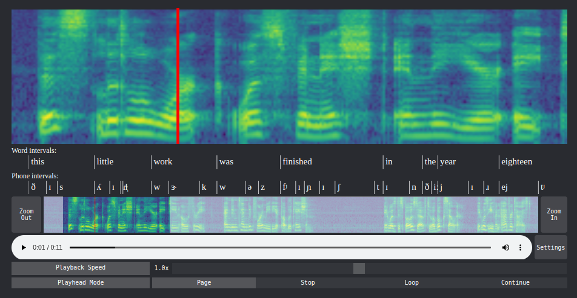

# react-audio-spectrogram-player

An audioplayer written in React that shows a spectrogram along with the audio. The playhead on the spectrogram is synchronized with the audioplayer. You can zoom in on the spectrogram and slow down the audio. It acts almost as a microscope for audio.

Note: At the moment, you still need to compute the spectrogram yourself and pass it to the component via the `src` prop.

If you use Python, there is also a jupyter widged based on this component. You can find it [here](https://pypi.org/project/speechwidgets/).

## Preview

See the [demo](https://react-audio-spectrogram-player.netlify.app/).



## Installation

```shell
npm i react-audio-spectrogram-player
```

## Usage

### Basic Usage

```js
import SpectrogramPlayer from "react-audio-spectrogram-player";

...

const App = () => {

    const src = ... // string: path to wav file

    const sxx = ... // number[][]: 2D array with spectrogram values

    return (
        <SpectrogramPlayer
            src={src}
            sxx={sxx}
        />
    )
}
```

### Customization

```jsx
return (
    <SpectrogramPlayer
        src={src}
        sxx={sxx}
        specHeight={200}
        navHeight={50}
        navigator
        settings
        colormap="viridis"
        transparent
        dark
    />
)
```

|Prop|Type|Default|Description|
|---|---|---|---|
|`src`|`string`|required|Path to the wav audio file.|
|`sxx`|`number[][]`|required|2D array with spectrogram values.|
|`specHeight`|`number`|`200`|Height of the main spectrogram.|
|`navigator`|`boolean`|`false`|Allow user to zoom in with the navigator UI.|
|`navHeight`|`number`|`50`|Height of the navigator UI.|
|`settings`|`boolean`|`false`|Allow user to change some playback behaviour.|
|`colormap`|`string`|`'viridis'`|The [colormap](https://www.npmjs.com/package/colormap) to use.|
|`transparent`|`boolean`|`false`|Use rgba values for spectrogram image.|
|`dark`|`boolean`|`false`|Use dark mode theme.|

### Annotations

You can annotate intervals (such as words or phones) below the spectrogram.

1. First place your annotation **data** in one or more `(string | number)[][]` objects.
    - Column 1:   Start time in seconds
    - Column 2:   End time in seconds
    - Column 3:   Annotation as a string
    
    For example:

    ```js
    const wordIntervals = [
        [0.54, 0.84, "this"],
        [0.84,  1.1, "little"],
        [ 1.1,  1.4, "work"],
        ...
    ]
    const phoneIntervals = [
        [0.54, 0.62, "ð"],
        [0.62, 0.67, "ɪ"],
        [0.67, 0.84, "s"],
        ...
    ]
    ```

2. Now create a **list** of **annotation objects** that will be passed to the component:
    ```js
    const annotations = [
        {
            data: wordIntervals,
            title: "Word intervals:",
            height: 30,
            strokeWidth: 1,
        },
        {
            data: phoneIntervals,
            title: "Phone intervals:",
            height: 30,
            strokeWidth: 1,
        }
    ]
    ```
    The `title`, `height` and `strokewidth` entries are optional.
    

2. Pass the **list** to the component via the `annotations` prop:


    ```jsx
    return (
        <SpectrogramPlayer
            src={src}
            sxx={sxx}
            specHeight={200}
            navHeight={50}
            annotations={annotations}
        />
    )
    ```

## Future Updates

- Calculate spectrogram with javascript when no `sxx` prop is supplied.
- Better touch screen compatibility.