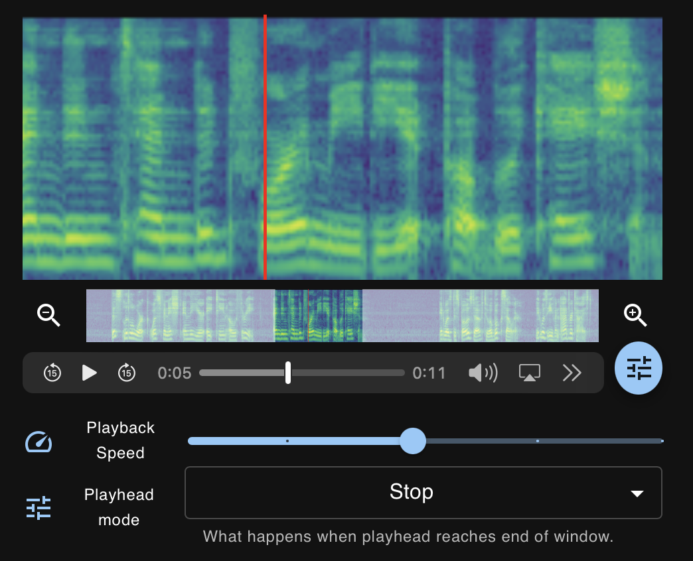

# react-audio-spectrogram-player

An audioplayer written in React that shows a spectrogram along with the audio. The playhead on the spectrogram is synchronized with the audioplayer. You can zoom in on the spectrogram and slow down the audio. It acts almost as a microscope for audio.

Note: At the moment, you still need to compute the spectrogram yourself and pass it to the component via the `src` prop.

## Preview

See the [demo](https://react-audio-spectrogram-player.netlify.app/).



## Installation

```shell
npm i react-audio-spectrogram-player
```

## Usage

### Basic Usage

```js
import SpectrogramPlayer from "react-audio-spectrogram-player";

...

const App = () => {

    const src = ... // string: path to wav file

    const sxx = ... // number[][]: 2D array with spectrogram values

    return (
        <SpectrogramPlayer
            src={src}
            sxx={sxx}
            specHeight={200}
            navHeight={50}
        />
    )
}
```

### Customization

```jsx
return (
    <SpectrogramPlayer
        src={src}
        sxx={sxx}
        specHeight={200}
        navHeight={50}
        navigator
        settings
        colormap="viridis"
        transparent
        dark
    />
)
```

|Prop|Type|Default|Description|
|---|---|---|---|
|`src`|`string`|required|Path to the wav audio file.|
|`sxx`|`number[][]`|required|2D array with spectrogram values.|
|`specHeight`|`number`|required|Height of the main spectrogram.|
|`navigator`|`boolean`|`false`|Allow user to zoom in with the navigator UI.|
|`navHeight`|`number`|`0`|Height of the navigator UI.|
|`settings`|`boolean`|`false`|Allow user to change some playback behaviour.|
|`colormap`|`string`|`'viridis'`|The [colormap](https://www.npmjs.com/package/colormap) to use.|
|`transparent`|`boolean`|`false`|Use rgba values for spectrogram image.|
|`dark`|`boolean`|`false`|Use dark mode theme.|

## Future Updates

- Calculate spectrogram with javascript when no `sxx` prop is supplied.
- Touch screen compatibility.